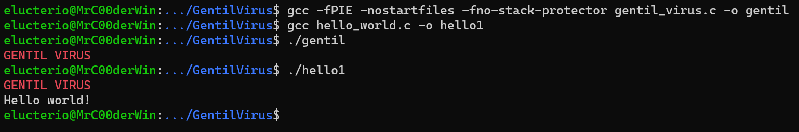

# Gentil virus
Adaptation of Ryan elfmaster [virus](https://bitlackeys.org/projects/lpv.c). Gentil virus will infect elf executable files only in the current directory. The size of the infected executable doesn't increase (if there is not enough room to insert the virus we give up).
The infected files will infect other files but a signature prevents multiple infections.

```bash
gcc -fPIE -nostartfiles -fno-stack-protector gentil_virus.c -o gentil
gcc hello_world.c -o hello1
```

Now if you run `./gentil` you get:


and if you now run `./hello1` you get:


you can now create another `hello`:
```bash 
gcc hello_world.c -o hello2
```

if you run `hello1` and then `hello2` you get:

